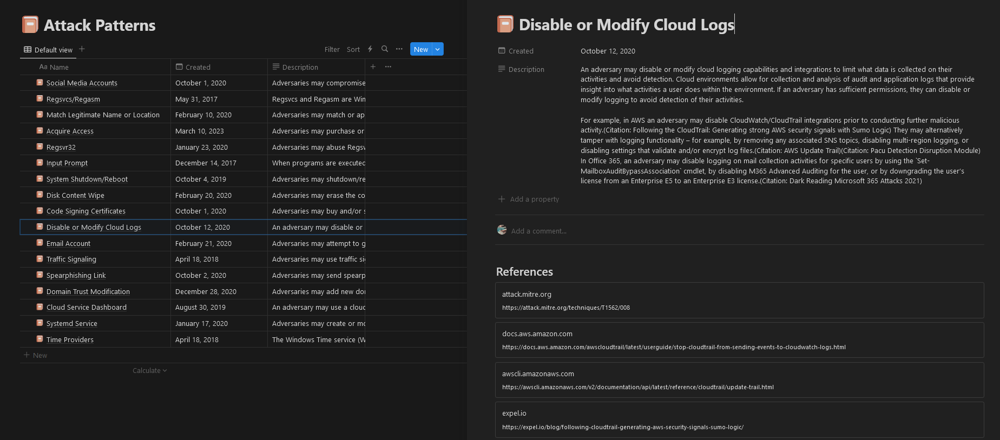

# 🔍 [STIX](https://oasis-open.github.io/cti-documentation/stix/intro.html) Threat Intelligence Integration for Notion


Integrate Threat intelligence into your Notion workspace with **notion-stix**. Designed to bring STIX (Structured Threat Information eXpression) formatted threat intelligence data directly into Notion, making it simpler than ever to organize, track, and correlate security threats.

## [View the website](https://notion-stix.up.railway.app/)

## 🌟 Features

- **Seamless Integration**: Easily integrate STIX formatted files into your Notion workspace.
- **Collaborative**: Share and collaborate on threat data with your team in Notion.
- **Customizable**: Tailor the integration settings to fit your specific needs.

## 🕵️ Data Sources

- [MITRE ATT&CK - Enterprise](https://attack.mitre.org/matrices/enterprise/) (v14.1) ✅

## 🚀 Quick Start

### Prerequisites

- Go version 1.21 or higher
- Notion API Key
- STIX formatted threat intelligence file

### Installation

```bash
# With go toolchain
go install github.com/brittonhayes/notion-stix/cmd/stix@latest
stix --help

# Or, with docker
docker run -e NOTION_API_KEY="<your-api-key>" -t ghcr.io/brittonhayes/notion-stix .
```

Congratulations! 🎉 Your Notion workspace is now empowered with MITRE threat intelligence.

## 📷 Preview





## 📜 License

**notion-stix** is made available under the [MIT License](LICENSE).

## 📖 Code of Conduct

Our community thrives on respect and kindness. Before contributing or participating, please read our [Code of Conduct](./docs/CODE_OF_CONDUCT.md).