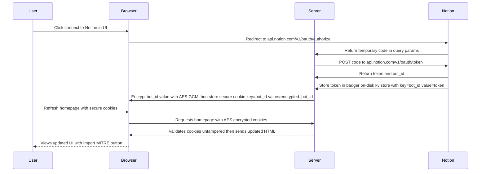

## Authorization

Architecture for the authorization flow between the user, browser, server, and Notion.

### Sequence Diagram

```mermaid
sequenceDiagram
    participant User
    participant Browser
    participant Server
    participant Notion
    User->>Browser: Click connect to Notion in UI
    Browser->>Notion: Redirect to api.notion.com/v1/oauth/authorize
    Notion->>Server: Return temporary code in query params
    Server->>Notion: POST code to api.notion.com/v1/oauth/token
    Notion->>Server: Return token and bot_id
    Notion->>Server: Store token in badger on-disk kv store with key=bot_id value=token
    Server->>Browser: Encrypt bot_id value with AES GCM then store secure cookie key=bot_id value=encrypted_bot_id
    User->>Browser: Refresh homepage with secure cookies
    Browser->>Server: Requests homepage with AES encrypted cookies
    Server-->>Browser: Validates cookies untampered then sends updated HTML
    Browser-->>User: Views updated UI with Import MITRE button
```